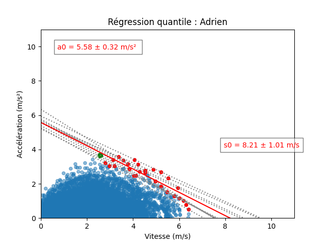

# Individual in-situ GPS-derived acceleration-speed profiling

## Introduction

This project accompanies the research paper titled [*Individual in-situ GPS-derived acceleration-speed profiling: towards automatization and refinement*](https://dx.doi.org/10.21203/rs.3.rs-3251516/v1) under-reviewed in the journal *Sports Medecine-Open* by [N. Miguens](https://www.linkedin.com/in/nathan-miguens-543118176/).

## Overview

Recently a [proof-of-concept](https://doi.org/10.1016/j.jbiomech.2021.110524) was proposed to derive the soccer players’ individual in-situ acceleration-speed (AS) profile from global positioning system (GPS) data collected over several sessions. The present study aimed to validate an automatized method of individual GPS-derived in-situ AS profiling in professional rugby union setting.

## Project Contents

1. **/data**: This directory contains a dataset for testing the code and providing an example of the expected file. 

2. **/code**: This directory contains the source code associated with the research. The code is divided into separate modules for easier understanding: *outliers* to identify outliers and *regression* to calculate AS profiles.

3. **/results**: This directory contains the results produced by the code: a csv file containing the characteristic values of the AS profiles by player and possibly by training exercise; point cloud images for each player and training exercise.

## Requirements

Python 3 is required to run the code for this project.

## Installation Instructions

1. Clone this repository to your local machine.
2. Install the required dependencies using the command: `pip install -r requirements.txt`
3. Run the main code using the command: `python main.py -s -k`

A dockerfile is also available.
## Usage

### Arguments

- The `-f` or `--filename` argument is used to select a csv file in data folder.
  ```bash
  python main.py --filename Session_example
  ```
- The `-s` argument is used to convert speed in km/h to m/s.
  ```bash
  python main.py -s 
  ```
- The `-k` argument is used to keep acceleration values from csv file.
  ```bash
  python main.py -k 
  ```
- The `--dv` argument is used to define the small speed range in max intensity identification.
  ```bash
  python main.py --dv 0.3
  ```
- The `--n_max` argument is used to define the numbers of points by small speed range in max intensity identification.
  ```bash
  python main.py --n_max 2
  ```

### Input file - Requirements

| Player  | Speed |  Timestamp  |
|---------|-------|-------------|
| Adrien  | 4.27  | 12:45:59.0  |
| Adrien  | 4.38  | 12:45:59.1  |
| Adrien  | 4.57  | 12:45:59.2  |

'Acceleration' and 'Date' can also be added.
## Results
### CSV results
| Player | a0 : Regression quantile | std_a0 | s0 : Regression quantile | std_s0 |
|----------|-----|---------|-------------| ---- |
| Adrien  | 5.57  |  0.31 | 8.20  |1.00 |
| Franck  | 7.01  | 0.35  | 9.32  |1.20 |
| Loic    | 6.42  |  0.19  | 7.52  |0.54|

### Image results 



## Contributing

If you wish to contribute to this project, follow these steps:
1. Fork the project
2. Create a new branch (`git checkout -b feature/add-feature`)
3. Commit the changes (`git commit -am 'Add feature'`)
4. Push the branch (`git push origin feature/add-feature`)
5. Open a pull request

## License

This project is licensed under [MIT License](https://opensource.org/licenses/MIT). See the `LICENSE.md` file for more details.

## Contacts

For any questions or concerns regarding this project, please contact [N. Miguens](https://www.linkedin.com/in/nathan-miguens-543118176/) or open an issue.

